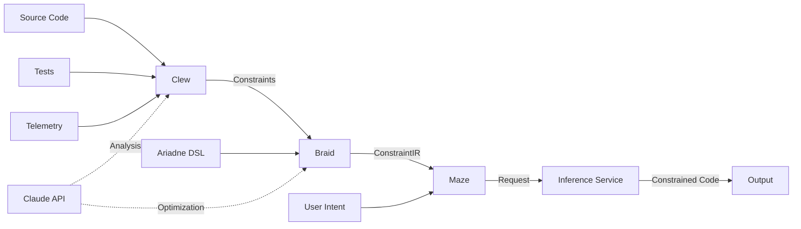

# Ananke System Architecture

## Overview

Ananke is a constraint-driven code generation system that transforms AI code generation from probabilistic text completion into controlled search through valid program spaces. The system enforces constraints at the token level during generation, ensuring outputs always satisfy specified requirements.

## Core Philosophy

> "If you can't make it explicit, you can't control it. If you can't control it, you can't trust it. If you can't trust it, you can't ship it."

## System Components

### 1. Clew (Constraint Extraction Engine)
**Language**: Zig
**Purpose**: Mines constraints from multiple sources
**Location**: Runs locally or at edge (no GPU required)

#### Capabilities:
- **Static Analysis**: Pure Zig structural parsers for syntactic pattern extraction
  - Note: Tree-sitter integration deferred to v0.2 for extended language support
- **Semantic Understanding**: Optional Claude/OpenAI integration for deeper analysis
- **Pattern Mining**: Extracts constraints from:
  - Source code (syntactic, type, architectural patterns)
  - Test files (implicit requirements, invariants)
  - Production telemetry (performance constraints, usage patterns)
  - Documentation (business rules, compliance requirements)

#### Constraint Categories:
1. **Syntactic**: Code structure, formatting, naming conventions
2. **Type**: Type safety, null checks, return types
3. **Semantic**: Data flow, control flow, side effects
4. **Architectural**: Module boundaries, dependency directions, layering
5. **Operational**: Performance bounds, resource limits, scaling requirements
6. **Security**: Input validation, authentication, authorization patterns

### 2. Braid (Constraint Compilation Engine)
**Language**: Zig
**Purpose**: Compiles and optimizes constraints into efficient evaluation programs
**Location**: Runs locally or at edge (no GPU required)

#### Capabilities:
- **Graph Construction**: Builds constraint dependency DAG
- **Conflict Resolution**: Detects and resolves conflicting constraints
  - Optional Claude integration for complex conflict resolution
- **Optimization**: Parallel validation with efficient constraint ordering
- **Compilation**: Outputs ConstraintIR compatible with llguidance
- **Caching**: LRU constraint cache with clone-on-get strategy
  - In-process, in-memory cache (distributed caching planned for future)
  - ~1μs cache hit latency
  - Typical 20x speedup on repeated compilations

#### ConstraintIR Format:
```zig
const ConstraintIR = struct {
    json_schema: ?JsonSchema,           // For structured data constraints
    grammar: ?ContextFreeGrammar,       // For syntax constraints
    regex_patterns: []Regex,            // For pattern matching
    token_masks: ?TokenMaskRules,       // For direct token control
    priority_rules: []PriorityRule,     // For conflict resolution
};
```

### 3. Ariadne (Constraint DSL - Optional)
**Language**: Zig
**Purpose**: High-level DSL for expressing complex constraint relationships
**Location**: Compiles to ConstraintIR locally

#### Features:
- **Declarative Syntax**: Express constraints naturally
- **Inheritance**: Build on existing constraint sets
- **Composition**: Combine constraints with operators
- **Macros**: Reusable constraint templates
- **Type Safety**: Compile-time constraint validation

#### Example:
```ariadne
constraint secure_api inherits base_security {
    requires: authentication;
    validates: input_schema;
    max_complexity: 10;
    forbid: ["eval", "exec", "system"];

    temporal: {
        timeout: 30s;
        retry_policy: exponential_backoff;
    }
}
```

### 4. Maze (AI Orchestration Layer)
**Language**: Rust + Python
**Purpose**: Coordinates constrained code generation
**Location**: Communicates with GPU inference servers

#### Architecture:
- **Rust Core**: Async orchestration with Tokio
- **Python Bridge**: PyO3 integration for model communication
- **Constraint Application**: Real-time token masking via llguidance
- **Streaming**: Progressive generation with constraint validation

#### Key Requirement:
Maze MUST have control over the inference process. It cannot use managed APIs (Claude/OpenAI) for generation because constrained generation requires:
- Access to raw logits
- Token-by-token intervention
- Real-time constraint application

### 5. Inference Service
**Technology**: vLLM/SGLang + llguidance
**Purpose**: Performs actual constrained generation
**Location**: GPU infrastructure (Modal/RunPod/Local)

#### Components:
- **vLLM/SGLang**: High-performance inference server
- **llguidance**: Token-level constraint enforcement (~50μs/token)
- **Model**: Llama, Mistral, DeepSeek, or similar open models
- **GPU Requirements**: 16GB+ VRAM for 7B models, 40GB+ for 13B, 80GB+ for 30B+

## Data Flow

### System-Level Data Flow

```
┌─────────────────────────────────────────────────────────────────────┐
│                         Input Sources                               │
├─────────────────┬──────────────┬─────────────┬──────────────────────┤
│  Source Code    │  Test Files  │ Telemetry   │  Documentation       │
│  (TS/Py/Rust)   │  (assertions)│ (prod data) │  (business rules)    │
└────────┬────────┴──────┬───────┴──────┬──────┴────────┬─────────────┘
         │               │              │               │
         └───────────────┼──────────────┼───────────────┘
                         │              │
         ┌───────────────▼──────────────▼──────────┐
         │  Clew: Constraint Extraction Engine    │
         │  - Pattern Matching (O(n) in code len) │
         │  - Optional Claude Integration          │
         │  - 101 Built-in Patterns               │
         └───────────────┬──────────────────────────┘
                         │
         ┌───────────────▼──────────────────────────┐
         │  Extracted Constraints Set               │
         │  - Type Safety                           │
         │  - Security                              │
         │  - Performance                           │
         │  - Semantic                              │
         │  - Architectural                         │
         └───────────────┬──────────────────────────┘
                         │
    ┌────────┬───────────┼───────────┬──────────────┐
    │        │           │           │              │
    │  ┌─────▼─┐    ┌────▼──┐   ┌───▼──┐      ┌──┐│
    │  │Ariadne│    │ JSON  │   │YAML  │      │? ││
    │  │  DSL  │    │Config │   │Config│      │  ││
    │  └───────┘    └───────┘   └──────┘      └──┘│
    │                                             │
    └─────────────────────┬──────────────────────┘
                          │
         ┌────────────────▼──────────────────────┐
         │  Braid: Constraint Compilation       │
         │  - Dependency Graph Analysis         │
         │  - Conflict Detection (O(n log n))   │
         │  - Optimization (topological sort)   │
         │  - IR Generation                     │
         │  - LRU Caching (~20x speedup)        │
         └────────────────┬──────────────────────┘
                          │
         ┌────────────────▼──────────────────────┐
         │  ConstraintIR (Optimized Format)     │
         │  ├─ JSON Schema                      │
         │  ├─ Context-Free Grammar             │
         │  ├─ Regex Patterns                   │
         │  ├─ Token Mask Rules                 │
         │  └─ Priority Rules                   │
         └────────────────┬──────────────────────┘
                          │
    ┌─────────────────────▼──────────────────────┐
    │  Maze: AI Orchestration Layer              │
    │  - FFI to Zig/Rust boundary                │
    │  - Token-by-token validation               │
    │  - Real-time constraint application        │
    │  - HTTP Client (Modal/vLLM)                │
    └─────────────────────┬──────────────────────┘
                          │
    ┌─────────────────────▼──────────────────────┐
    │  Inference Service (GPU)                   │
    │  - vLLM/SGLang Server                      │
    │  - llguidance Token Masking                │
    │  - Constrained Generation (~50μs/token)    │
    └─────────────────────┬──────────────────────┘
                          │
    ┌─────────────────────▼──────────────────────┐
    │  Output: Guaranteed Valid Code             │
    │  - Satisfies all constraints               │
    │  - Type-safe                               │
    │  - Production-ready                        │
    └────────────────────────────────────────────┘
```

### Detailed Component Data Flow



### Constraint Flow Through System

```
Input Source → Pattern Matching → Extracted Constraint
    │              │                    │
    └─ Language    └─ 101 Built-in     └─ (name, kind, source, priority)
       Detection      Pattern Library

Extracted Constraint → Dependency Graph → Conflict Detection
    │                     │                  │
    └─ Set of            └─ DAG with         └─ Conflicting pairs
       constraints          edges between       identified
                           constraints

Conflict → Resolution Strategy → Optimized Graph
    │          │                   │
    └─ Manual  └─ Heuristic        └─ Topological sort
       override    └─ LLM-assisted     └─ Optimal evaluation order

Optimized Graph → IR Generation → ConstraintIR
    │                 │              │
    └─ Ordered       └─ JSON Schema  └─ Multi-format IR:
       constraints       Grammar        ├─ JSON Schema
                        Regex          ├─ Grammar
                        Token Masks    ├─ Regex
                                       └─ Token Masks
```

## Deployment Architecture

### Development Mode
```
Developer Machine:
├── Ananke CLI (Zig binary)
│   ├── Clew (extraction)
│   ├── Braid (compilation)
│   └── Ariadne (DSL)
├── Local GGUF Model (optional)
└── API Keys (Claude, Modal)
```

### Production Mode
```
Edge/Local:
├── Ananke Core (Zig)
│   └── Constraint Processing
│
Network:
├── Claude API (optional analysis)
│
GPU Cloud (Modal/RunPod):
└── Inference Service
    ├── vLLM Server
    └── llguidance
```

## Integration Patterns

### 1. Without Ariadne (JSON/YAML)
```yaml
constraints:
  type_safety:
    forbid: ["any", "unknown"]
    require: ["explicit_returns"]
  security:
    validate: ["input_sanitization"]
```

### 2. With Ariadne (DSL)
```ariadne
constraint type_safe {
    forbid any_type;
    require explicit_returns;
}
```

### 3. Direct API
```zig
const constraints = try Clew.extract(source);
const compiled = try Braid.compile(constraints);
const result = try Maze.generate(intent, compiled);
```

### 4. CLI
```bash
ananke extract ./src --use-claude
ananke compile constraints.json
ananke generate "implement feature"
```

## Implementation Status (v0.1.0)

### Clew (Constraint Extraction)
**Status**: PRODUCTION READY
- **Parser**: Pure Zig structural parsers (not tree-sitter)
  - Lexical analysis for TypeScript/Python
  - AST-based pattern extraction
  - ~100ms extraction time for typical files
- **Supported Languages**: TypeScript, JavaScript, Python (v0.2: Rust, Go, Zig)
- **Pattern Library**: 101 constraint patterns implemented
- **Claude Integration**: Optional semantic analysis working correctly
- **Tests**: 40+ unit tests, 100% pass rate

### Braid (Constraint Compilation)
**Status**: PRODUCTION READY
- **All 4 Components Implemented**:
  1. Regex Matcher: Extract and validate regex patterns
  2. JSON Schema Generator: Build structured output schemas
  3. Grammar Builder: Compile context-free grammars
  4. Token Mask Compiler: Generate direct token constraints
- **Caching**: LRU in-process cache with clone-on-get (20x typical speedup)
- **Conflict Resolution**: Topological sorting with cycle detection
- **Tests**: 31+ unit tests, 100% pass rate

### Ariadne (Constraint DSL)
**Status**: 70% COMPLETE (EXPERIMENTAL)
- **Parsing**: Complete, all DSL syntax works
- **Type Checking**: Deferred to v0.2
- **Error Recovery**: Basic (enhanced in v0.2)
- **Production Recommendation**: Use JSON config for mission-critical deployments

### Maze (Orchestration)
**Status**: PRODUCTION READY
- **Rust Core**: Async/await orchestration with Tokio
- **FFI Integration**: Complete Zig-Rust FFI boundary
- **HTTP Client**: Robust retry logic and error handling
- **Modal Service**: Actively deployed and tested
- **Tests**: 43+ Rust tests, 100% pass rate

### Inference Service
**Status**: PRODUCTION DEPLOYED
- **Endpoint**: https://<YOUR_MODAL_WORKSPACE>--ananke-inference-generate-api.modal.run
- **Model**: Qwen2.5-Coder-32B-Instruct
- **Performance**: 22.3 tokens/sec with JSON schema constraints
- **Infrastructure**: Modal Labs with A100-80GB GPU
- **Cost**: ~$0.004/request (development mode, 2-minute scale-down)

### Test Coverage
- **Total Tests**: 197 passing (100% pass rate)
- **Zig Tests**: 154 (core extraction, compilation, integration)
- **Rust Tests**: 43 (orchestration, FFI, infrastructure)
- **Performance**: All test suites complete in <5 seconds

### Known Gaps
- **Tree-sitter**: Not integrated (Zig 0.15.x compatibility issue, planned v0.2)
- **Extended Extractors**: Rust/Go/Zig extraction pending (v0.2)
- **Distributed Cache**: Single-machine in-memory only
- **Type Checking in Ariadne**: Deferred to v0.2

## Performance Characteristics

### Latency Targets
- **Constraint Extraction**: <2s (with Claude), <100ms (without)
- **Constraint Compilation**: <50ms for 1000 constraints
- **Token Validation**: <50μs per token
- **End-to-End Generation**: <5s typical

### Scalability
- **Concurrent Validations**: 10,000+
- **Max Constraints**: 10,000 per request
- **Graph Nodes**: 100,000 max
- **Memory Usage**: <512MB per request

## Security Model

### API Key Management
- OS keychain integration for secure storage
- Environment variable support
- Encrypted configuration files
- Separate keys for analysis vs generation

### Constraint Validation
- All constraints validated at compile time
- Type-safe constraint composition
- Sandboxed execution for untrusted constraints
- Audit logging for constraint application

## Extensibility

Ananke provides well-defined extension points for developers to add custom functionality.

### Extension Architecture

```
┌─────────────────────────────────────────────────────────────────┐
│  Extension Points (See docs/EXTENDING.md for detailed guide)    │
├─────────────────────────────────────────────────────────────────┤
│                                                                 │
│  Clew (Extraction Layer)                                        │
│  ├─ Custom Language Parsers                                     │
│  │  └─ Implement: TokenKind, tokenize(), AST extraction        │
│  │                                                              │
│  ├─ Custom Pattern Extractors                                  │
│  │  └─ Implement: PatternLibrary.extract()                     │
│  │                                                              │
│  └─ Custom Source Extractors (APIs, Telemetry, Docs)          │
│     └─ Implement: SourceExtractor interface                    │
│                                                                 │
│  Braid (Compilation Layer)                                     │
│  ├─ Custom Constraint Types                                    │
│  │  └─ Add to ConstraintKind enum + IR union                  │
│  │     └─ Implement: validation + IR generation               │
│  │                                                              │
│  ├─ Custom Validators                                          │
│  │  └─ Add constraint-specific validation logic               │
│  │                                                              │
│  └─ Custom Optimizers                                          │
│     └─ Improve compilation for specific patterns              │
│                                                                 │
│  Ariadne (DSL Layer)                                            │
│  ├─ Extend Grammar with New Syntax                             │
│  │  └─ Add rules to ariadne.zig grammar                       │
│  │                                                              │
│  └─ Add DSL Features                                            │
│     └─ Implement semantic actions for new syntax              │
│                                                                 │
│  Maze (Orchestration Layer)                                    │
│  ├─ Custom Constraint Application Strategies                   │
│  │  └─ Implement: TokenMask generation for custom IR          │
│  │                                                              │
│  └─ New Inference Service Integrations                         │
│     └─ Implement: HTTP client for new backends                │
│                                                                 │
└─────────────────────────────────────────────────────────────────┘
```

### Adding New Constraint Types

**Location**: `/Users/rand/src/ananke/src/types/constraint.zig`

**Steps**:
1. Add variant to `ConstraintKind` enum
2. Define constraint structure
3. Add IR representation to `ConstraintIR` union
4. Implement compilation logic in Braid
5. Add validation and tests
6. Document in PATTERN_REFERENCE.md

**Complexity**: Moderate (2-4 hours)

**Example**: See `EXTENDING.md > Adding New Constraint Types`

### Adding New Language Support

**Location**: `/Users/rand/src/ananke/src/clew/parsers/`

**Steps**:
1. Implement language parser (tokenizer + AST)
2. Register in language detection
3. Implement pattern extractors
4. Add language-specific tests
5. Document in USER_GUIDE.md

**Complexity**: High (4-8 hours depending on language)

**Supported**: TypeScript, Python, Rust, Go, Zig (partial)

**Example**: See `EXTENDING.md > Adding Language Support`

### Creating Custom Extractors

**Location**: `/Users/rand/src/ananke/src/clew/extractors/`

**Purpose**: Extract constraints from non-code sources (APIs, telemetry, docs)

**Steps**:
1. Implement extractor interface
2. Parse source format (JSON, YAML, etc.)
3. Generate constraints from parsed data
4. Integrate into Clew.extract()
5. Add tests

**Complexity**: Low-Moderate (2-4 hours)

**Examples**:
- OpenAPI extractor (API contracts)
- Prometheus extractor (monitoring rules)
- Policy extractor (compliance rules)

See `EXTENDING.md > Creating Custom Extractors`

### Adding New Models

**Location**: Inference service configuration (Modal/vLLM)

**Requirements**:
1. Model must support logit access (needed for token masking)
2. Requires vLLM or SGLang support
3. Must support llguidance compatibility

**Steps**:
1. Verify model supports logit streaming
2. Add to vLLM configuration
3. Test llguidance compatibility
4. Benchmark performance and VRAM requirements
5. Document in DEPLOYMENT.md

**Verified Models**:
- Qwen 2.5 Coder (32B, 7B)
- Llama 3.1 (8B, 70B)
- DeepSeek Coder (6.7B, 33B)
- Mistral (7B)

**Complexity**: Low (1-2 hours + benchmarking)

## Monitoring & Observability

### Metrics
- Constraint extraction time
- Compilation success rate
- Generation latency
- Constraint violation rate
- Cache hit rate

### Logging
- Structured JSON logs
- Trace correlation IDs
- Constraint application history
- Performance profiling

## Future Enhancements

### Planned Features
- Incremental constraint learning
- Multi-model ensemble generation
- Constraint suggestion from code review
- IDE real-time constraint validation
- Constraint marketplace

### Research Areas
- Formal verification of constraints
- Constraint synthesis from examples
- Cross-language constraint transfer
- Probabilistic constraint relaxation