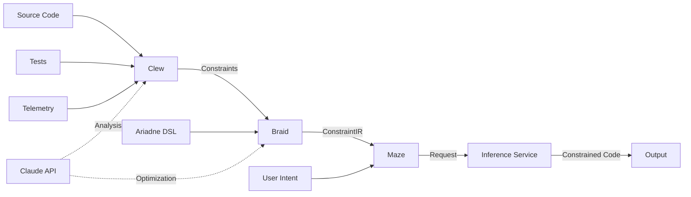

# Ananke System Architecture

## Overview

Ananke is a constraint-driven code generation system that transforms AI code generation from probabilistic text completion into controlled search through valid program spaces. The system enforces constraints at the token level during generation, ensuring outputs always satisfy specified requirements.

## Core Philosophy

> "If you can't make it explicit, you can't control it. If you can't control it, you can't trust it. If you can't trust it, you can't ship it."

## System Components

### 1. Clew (Constraint Extraction Engine)
**Language**: Zig
**Purpose**: Mines constraints from multiple sources
**Location**: Runs locally or at edge (no GPU required)

#### Capabilities:
- **Static Analysis**: Tree-sitter based parsing for syntactic patterns
- **Semantic Understanding**: Optional Claude/OpenAI integration for deeper analysis
- **Pattern Mining**: Extracts constraints from:
  - Source code (syntactic, type, architectural patterns)
  - Test files (implicit requirements, invariants)
  - Production telemetry (performance constraints, usage patterns)
  - Documentation (business rules, compliance requirements)

#### Constraint Categories:
1. **Syntactic**: Code structure, formatting, naming conventions
2. **Type**: Type safety, null checks, return types
3. **Semantic**: Data flow, control flow, side effects
4. **Architectural**: Module boundaries, dependency directions, layering
5. **Operational**: Performance bounds, resource limits, scaling requirements
6. **Security**: Input validation, authentication, authorization patterns

### 2. Braid (Constraint Compilation Engine)
**Language**: Zig
**Purpose**: Compiles and optimizes constraints into efficient evaluation programs
**Location**: Runs locally or at edge (no GPU required)

#### Capabilities:
- **Graph Construction**: Builds constraint dependency DAG
- **Conflict Resolution**: Detects and resolves conflicting constraints
  - Optional Claude integration for complex conflict resolution
- **Optimization**: SIMD-accelerated parallel validation
- **Compilation**: Outputs ConstraintIR compatible with llguidance
- **Caching**: Persistent constraint cache for performance

#### ConstraintIR Format:
```zig
const ConstraintIR = struct {
    json_schema: ?JsonSchema,           // For structured data constraints
    grammar: ?ContextFreeGrammar,       // For syntax constraints
    regex_patterns: []Regex,            // For pattern matching
    token_masks: ?TokenMaskRules,       // For direct token control
    priority_rules: []PriorityRule,     // For conflict resolution
};
```

### 3. Ariadne (Constraint DSL - Optional)
**Language**: Zig
**Purpose**: High-level DSL for expressing complex constraint relationships
**Location**: Compiles to ConstraintIR locally

#### Features:
- **Declarative Syntax**: Express constraints naturally
- **Inheritance**: Build on existing constraint sets
- **Composition**: Combine constraints with operators
- **Macros**: Reusable constraint templates
- **Type Safety**: Compile-time constraint validation

#### Example:
```ariadne
constraint secure_api inherits base_security {
    requires: authentication;
    validates: input_schema;
    max_complexity: 10;
    forbid: ["eval", "exec", "system"];

    temporal: {
        timeout: 30s;
        retry_policy: exponential_backoff;
    }
}
```

### 4. Maze (AI Orchestration Layer)
**Language**: Rust + Python
**Purpose**: Coordinates constrained code generation
**Location**: Communicates with GPU inference servers

#### Architecture:
- **Rust Core**: Async orchestration with Tokio
- **Python Bridge**: PyO3 integration for model communication
- **Constraint Application**: Real-time token masking via llguidance
- **Streaming**: Progressive generation with constraint validation

#### Key Requirement:
Maze MUST have control over the inference process. It cannot use managed APIs (Claude/OpenAI) for generation because constrained generation requires:
- Access to raw logits
- Token-by-token intervention
- Real-time constraint application

### 5. Inference Service
**Technology**: vLLM/SGLang + llguidance
**Purpose**: Performs actual constrained generation
**Location**: GPU infrastructure (Modal/RunPod/Local)

#### Components:
- **vLLM/SGLang**: High-performance inference server
- **llguidance**: Token-level constraint enforcement (~50μs/token)
- **Model**: Llama, Mistral, DeepSeek, or similar open models
- **GPU Requirements**: 16GB+ VRAM for 7B models, 40GB+ for 13B, 80GB+ for 30B+

## Data Flow



## Deployment Architecture

### Development Mode
```
Developer Machine:
├── Ananke CLI (Zig binary)
│   ├── Clew (extraction)
│   ├── Braid (compilation)
│   └── Ariadne (DSL)
├── Local GGUF Model (optional)
└── API Keys (Claude, Modal)
```

### Production Mode
```
Edge/Local:
├── Ananke Core (Zig)
│   └── Constraint Processing
│
Network:
├── Claude API (optional analysis)
│
GPU Cloud (Modal/RunPod):
└── Inference Service
    ├── vLLM Server
    └── llguidance
```

## Integration Patterns

### 1. Without Ariadne (JSON/YAML)
```yaml
constraints:
  type_safety:
    forbid: ["any", "unknown"]
    require: ["explicit_returns"]
  security:
    validate: ["input_sanitization"]
```

### 2. With Ariadne (DSL)
```ariadne
constraint type_safe {
    forbid any_type;
    require explicit_returns;
}
```

### 3. Direct API
```zig
const constraints = try Clew.extract(source);
const compiled = try Braid.compile(constraints);
const result = try Maze.generate(intent, compiled);
```

### 4. CLI
```bash
ananke extract ./src --use-claude
ananke compile constraints.json
ananke generate "implement feature"
```

## Performance Characteristics

### Latency Targets
- **Constraint Extraction**: <2s (with Claude), <100ms (without)
- **Constraint Compilation**: <50ms for 1000 constraints
- **Token Validation**: <50μs per token
- **End-to-End Generation**: <5s typical

### Scalability
- **Concurrent Validations**: 10,000+
- **Max Constraints**: 10,000 per request
- **Graph Nodes**: 100,000 max
- **Memory Usage**: <512MB per request

## Security Model

### API Key Management
- OS keychain integration for secure storage
- Environment variable support
- Encrypted configuration files
- Separate keys for analysis vs generation

### Constraint Validation
- All constraints validated at compile time
- Type-safe constraint composition
- Sandboxed execution for untrusted constraints
- Audit logging for constraint application

## Extensibility

### Adding New Constraint Types
1. Define constraint in Zig type system
2. Implement validation logic
3. Add llguidance compilation
4. Update Ariadne grammar (optional)

### Adding New Language Support
1. Add Tree-sitter grammar
2. Implement language-specific extractors
3. Define language constraints
4. Test with real codebases

### Adding New Models
1. Ensure model supports logit access
2. Add to vLLM configuration
3. Test llguidance compatibility
4. Benchmark performance

## Monitoring & Observability

### Metrics
- Constraint extraction time
- Compilation success rate
- Generation latency
- Constraint violation rate
- Cache hit rate

### Logging
- Structured JSON logs
- Trace correlation IDs
- Constraint application history
- Performance profiling

## Future Enhancements

### Planned Features
- Incremental constraint learning
- Multi-model ensemble generation
- Constraint suggestion from code review
- IDE real-time constraint validation
- Constraint marketplace

### Research Areas
- Formal verification of constraints
- Constraint synthesis from examples
- Cross-language constraint transfer
- Probabilistic constraint relaxation